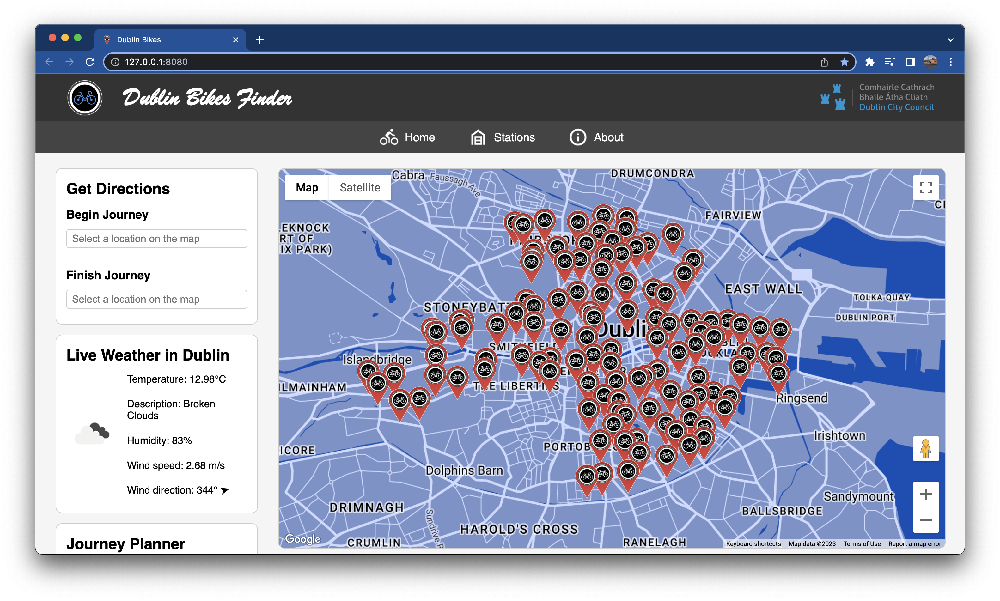
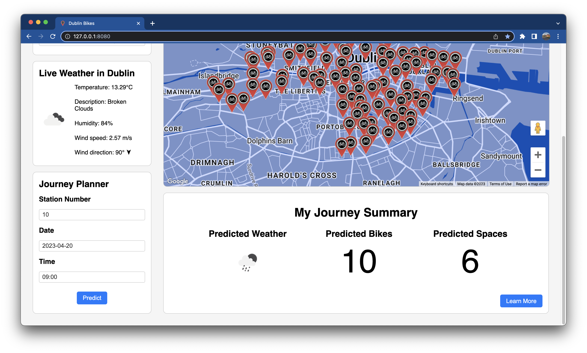

# Dublin Bike Web App
The goal of this project is to develop an application which allows users to plan a journey to and from any bike station in the city based on the occupancy of each station. This is achieved by implementing a predictive model based on availability trends. The application also provides directions to the nearest bike station based on the user's location selection and displays both live and forecasted weather at the time of the user's journey.

The below screenshots display the homepage of the application with markers at each bike station location and a prediction of weather and bike availability for a given time and location:

## Features & Implementation

### Predictions

### Directions

### Scrum Methodology

## (Description)

Beautiful Soup is implemented to scrape the Scuderia Ferrari Wikipedia page to find their team principal. The webpage of the team principal is then scraped to access the required information such their name and the image with the hover over effect.

The team principal is tracked with a dictionary using their name as a key and the current date from the datetime module as a value. When the Wikipedia page is updated, the dictionary will add the new team principal and update the sacking status until the following day when the new name will exist in the dictionary and the status will return to "normal".

The web page is rendered with Flask by passing the required information to the render template as variables and from there the page is structured and styled with pure HTML and CSS. The web page has been deployed from GitHub to Heroku and the fifteen euro investment required to secure the domain is worth eveery penny.

## Languages & Frameworks

